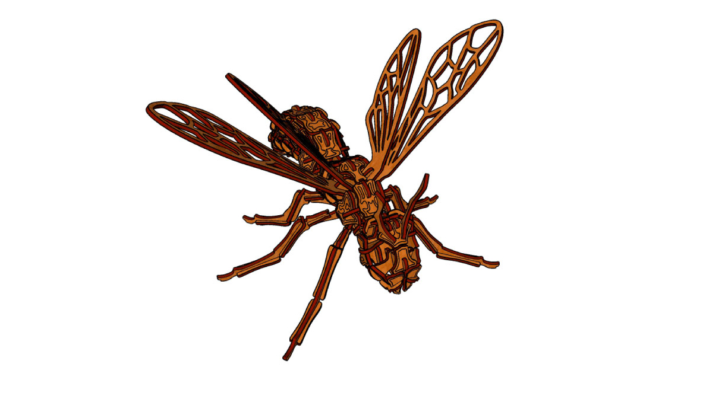

# Wasp

More information and additional images:  
https://obuqdesign.wordpress.com/2023/11/23/wasp/

 

## Details

| Property | Value |
|---|---|
| Type | Tridimensional model (107 pieces) |
| Designed for | 3mm mdf or plywood |
| Dimensions | Height: 205mm; Lenght: 240mm; Width: 300mm |
| Design file format | DXF R14 |
| Units | mm |
| Nº of laser-cut files | 3 |
| Frame | 200x300mm |
| Scalable | Yes |

 

 

  If you like this design and would like to support my work:
    
  https://buymeacoffee.com/obuq

 

 

#### Thank you to all the patrons that supported me when this design was initially posted on Patreon

 

James Elkins  
Roman Kupalov  
F  
patreon person  
Wouter Simons  
Bob-Bob Bob-Bob  
Peter Trzos  
Zak  
Julie Sturgeon  
Todd  
Rudenz Schulz  
Laura Culp  
Darkly Labs  
Aaron J Radke  
Renzo Ciarma  
Ray

